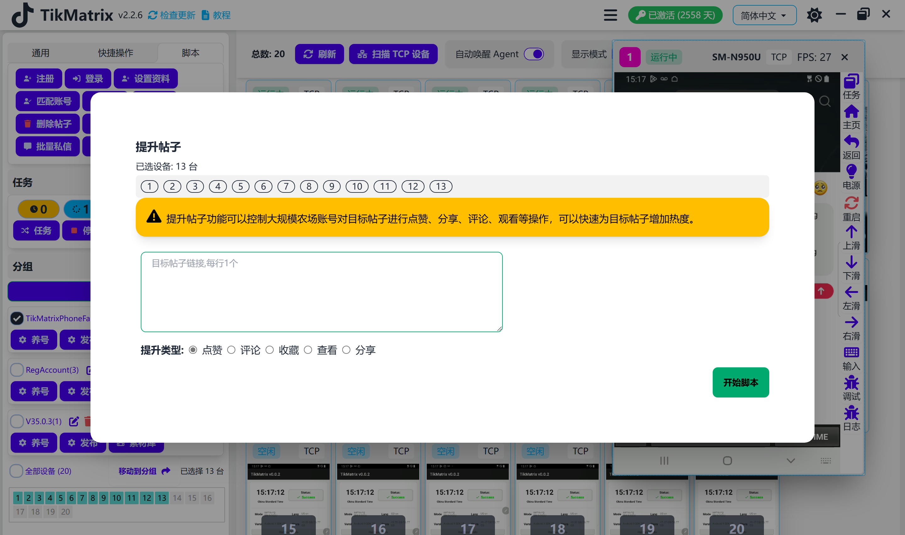

# 内容互动

内容互动脚本用于通过点赞、评论、分享、收藏和查看来提升帖子互动。

## 步骤

1. 确保账号已添加到账号列表中。
2. 确保已创建分组并且设备已移动到该分组。
3. 选择要互动的设备。
4. 点击 `Tk Toolbox` - `Boost Posts` 按钮。
5. 输入目标帖子URL，每行一个。
6. 点击 `Like`、`Comment`、`Share`、`Favorite` 或 `View` 按钮。

## 注意事项

* 内容互动脚本不是100%成功的，您可能需要重试失败的任务。

## 截图

