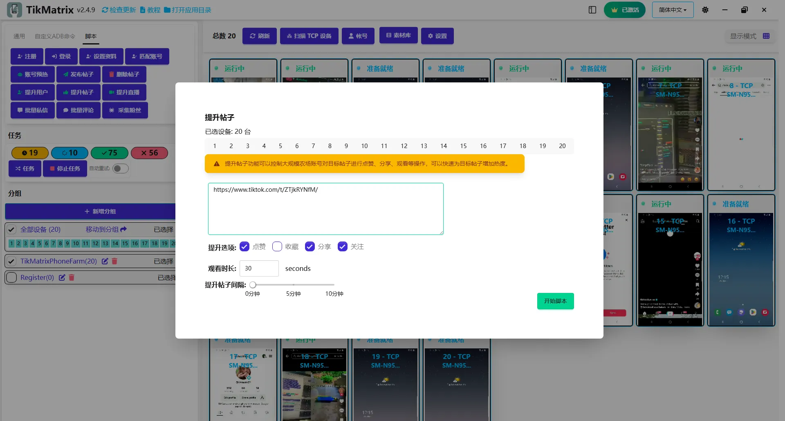

# 提升帖子

:::warning 下线提示
该脚本功能已整合进 [Super Boost](./14.super-boost.md) 脚本。请改用 Super Boost，本脚本将在未来版本中移除。
:::

提升帖子脚本用于通过批量点赞、分享、收藏和观看来增加帖子的互动。我们的先进算法模拟自然的人类行为以避免被检测。

## 工作原理

### 智能互动时机

与在观看结束时执行所有操作的传统自动化工具不同，TikMatrix使用智能随机化系统：

1. **随机调度**：每个互动操作（点赞、收藏、关注、转发、分享）都被分配一个在观看时长内的随机执行时间
2. **自然分布**：操作分布在整个观看期间，模拟真实用户与内容的互动方式
3. **有机行为**：没有两个会话遵循相同的模式，使自动化几乎无法被检测

### 工作流程

1. **打开帖子**：脚本导航到目标帖子URL
2. **观看模拟**：开始观看视频指定的时长
3. **随机化互动**：在观看期间随机间隔执行启用的操作：
   - **点赞**：在随机时刻触发（1秒到观看时长）
   - **收藏**：在观看期间不可预测的时间添加
   - **关注**：用户关注在自然间隔发生
   - **转发**：内容分享有机发生
   - **短信分享**：增加分享数但不实际发送消息
4. **完成**：所有操作在观看时间框架内完成

## 步骤

1. 选择要运行脚本的设备。
2. 点击`脚本` > `提升帖子`。
3. 配置任务设置：
    - **帖子URL**：输入目标帖子URL，每行一个。
    - **提升选项**：选择点赞、分享、转发、收藏或关注用户。
    - **观看时长**：设置观看每个帖子的时长（操作将在此时间内随机化）。
    - **提升帖子间隔**：设置每个任务之间的间隔。
4. 点击`开始脚本`开始执行。

## 防检测功能

### 行为随机化

- **可变时机**：互动时机没有固定模式
- **类人延迟**：操作之间的自然停顿
- **自适应调度**：每个会话创建独特的互动模式

### 技术保障

- **WebView检测**：自动处理浏览器重定向
- **错误恢复**：优雅处理失败的互动
- **会话管理**：帖子之间的适当清理

## 注意事项

- 提升帖子脚本可能不总是成功；如需要请重试失败的任务。
- **分享**选项将打开短信应用以增加分享数，但不会实际发送消息。
- 所有互动都经过随机化以防止检测 - 没有两次运行会有相同的时机模式。

## 截图

