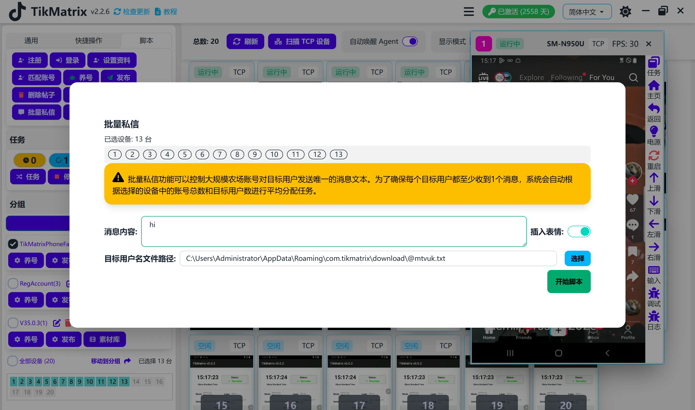

# 批量私信

批量私信脚本用于向多个TikTok账户批量发送消息。

## 步骤

1. 选择要运行脚本的设备。
2. 点击`脚本` > `批量私信`。
3. 配置任务设置：
    - **发送个人资料卡片**：选择是否随消息发送个人资料卡片（例如：@tikmatrix001）。
    - **消息内容**：输入要发送的消息。
    - **插入表情符号**：选择是否在消息中插入表情符号。
    - **目标账户文件**：选择包含目标账户的文件，每行一个。
4. 点击`开始脚本`开始执行。

## 注意事项

- 批量私信脚本可能不总是成功；如需要请重试失败的任务。

## 截图

